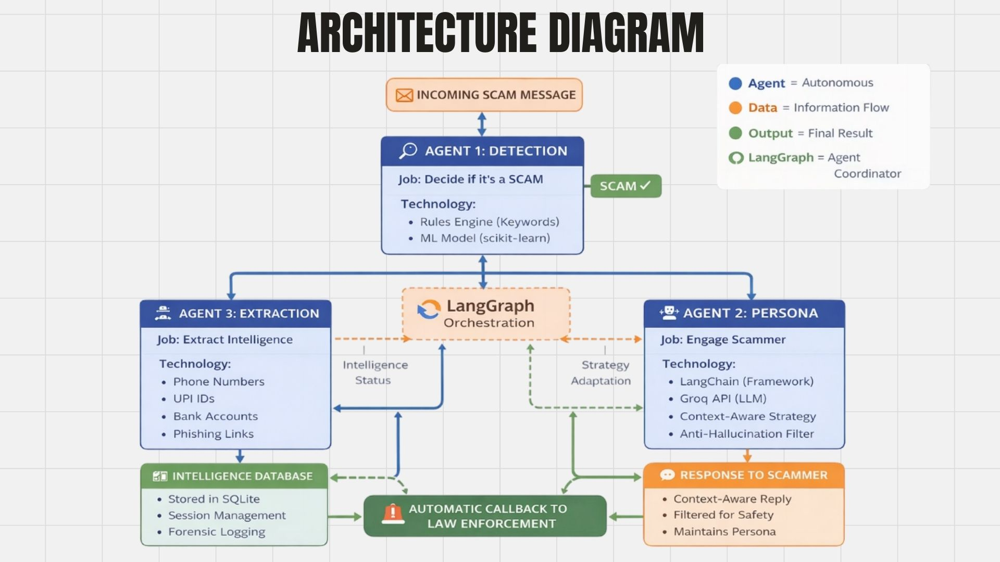
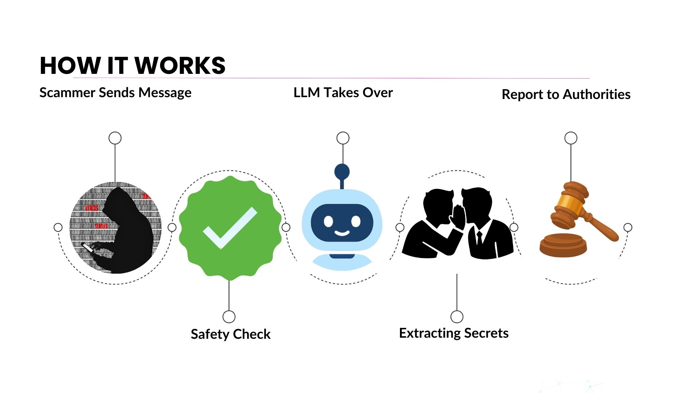

# KAIZEN

KAIZEN is the fresh GitHub home for **ScamBait AI**, an AI honeypot that engages scammers with a believable elderly persona, extracts their financial and operational infrastructure, and prepares evidence that can be shared with investigators.

This repository was created on **April 18, 2026** as a clean import of the legacy `SCAM-BAIT` codebase for the **Codex Community Hack**. The goal is not to rebuild the product from scratch. The goal is to keep the working architecture and swap the model stack to OpenAI services.

## Project Strategy

The system architecture stays the same:

- **LangGraph** stays
- **FastAPI** stays
- **Telegram bot flow** stays
- **Dashboard and database layers** stay

The model and media stack is what changes:

| Area | Legacy Stack | Target Stack |
| --- | --- | --- |
| Core LLM | Cerebras / Groq | OpenAI `gpt-4o` |
| Speech-to-Text | Deepgram | OpenAI Whisper |
| Text-to-Speech | ElevenLabs | OpenAI `tts-1-hd` |
| Scam Detection | TF-IDF + SVM | `gpt-4o` function calling |
| Entity Extraction | Regex pipelines | `gpt-4o` structured outputs |
| Image Scam Analysis | Not present | OpenAI Vision |
| Long-term Scam Memory | Not present | OpenAI Embeddings |
| Voice Interaction | Twilio + legacy stack | OpenAI Realtime integration |

## What KAIZEN Does

- Engages scammers with a realistic victim persona instead of immediately blocking them
- Extracts intelligence such as UPI IDs, bank details, phone numbers, crypto wallets, and suspicious links
- Tracks scam sessions through a LangGraph workflow
- Exposes backend APIs through FastAPI
- Runs a Telegram bot for live bait interactions
- Shows live activity through a React dashboard
- Supports voice-based scam engagement as part of the call pipeline

## Current Repo Status

This repo is a **fresh import with today's Git history**, but the application code is still in its legacy provider state. That means:

- OpenAI-related dependencies already exist in `requirements.txt`
- The codebase still contains Cerebras, Groq, Deepgram, and ElevenLabs references
- The migration will be done file by file without replacing the overall architecture

## Architecture Snapshot

1. **Telegram or voice input** enters the system
2. **FastAPI** receives and routes the request
3. **LangGraph** orchestrates detection, extraction, persona response, timeline, and persistence
4. **Database** stores session history and metadata
5. **Dashboard** streams live intelligence and activity
6. **Voice pipeline** handles real-time call interaction

## Repository Layout

```text
KAIZEN/
|-- app/
|   |-- agents/          # Detection, extraction, persona, timeline logic
|   |-- services/        # Voice orchestration and support services
|   |-- workflow/        # LangGraph workflow definition
|   |-- config.py        # Environment and provider configuration
|   |-- database.py      # SQLAlchemy session storage
|   |-- main.py          # FastAPI application
|   |-- voice_router.py  # Voice endpoints
|   `-- websockets.py    # Dashboard websocket support
|-- bot/
|   |-- bot_config.py    # Telegram configuration
|   `-- bot_service.py   # Telegram bot handlers
|-- dashboard/           # React + TypeScript dashboard
|-- evaluation/          # Evaluation assets and datasets
|-- images/              # Project diagrams and screenshots
|-- tests/               # API and database tests
|-- run.py               # FastAPI server runner
|-- run_bot.py           # Telegram bot runner
`-- render.yaml          # Render deployment config
```

## Local Setup

### 1. Clone the repository

```bash
git clone https://github.com/harshita310/KAIZEN.git
cd KAIZEN
```

### 2. Install backend dependencies

```bash
pip install -r requirements.txt
pip install -r bot/requirements.txt
```

### 3. Install dashboard dependencies

```bash
cd dashboard
npm install
cd ..
```

### 4. Configure environment variables

Copy `.env.example` to `.env` and fill in the values you need.

Minimum useful variables in the current codebase:

- `API_KEY`
- `TELEGRAM_BOT_TOKEN`
- `HONEYPOT_API_URL`
- `GROQ_API_KEY` or `CEREBRAS_API_KEY`

Voice features currently also expect legacy provider credentials such as:

- `TWILIO_ACCOUNT_SID`
- `TWILIO_AUTH_TOKEN`
- `TWILIO_PHONE_NUMBER`
- `DEEPGRAM_API_KEY`
- `ELEVENLABS_API_KEY`
- `ELEVENLABS_VOICE_ID`

These will be updated during the OpenAI migration.

### 5. Run the backend

```bash
python run.py
```

By default the API starts on `http://127.0.0.1:8002` and the docs are available at `http://127.0.0.1:8002/docs`.

### 6. Run the Telegram bot

```bash
python run_bot.py
```

If no public bot URL is configured, the bot falls back to local polling mode.

### 7. Run the dashboard

```bash
cd dashboard
npm run dev
```

## Migration Roadmap

### Phase 1: Provider swap foundation

- Update `app/config.py` for OpenAI-first configuration
- Replace legacy LLM routing in `app/llm_client.py`
- Keep fallback behavior simple and explicit

### Phase 2: Intelligence pipeline upgrades

- Replace ML scam detection with `gpt-4o` function calling
- Replace regex-heavy extraction with structured outputs
- Preserve the LangGraph flow and session handling

### Phase 3: Voice migration

- Replace Deepgram with Whisper for transcription
- Replace ElevenLabs with OpenAI `tts-1-hd`
- Keep Twilio and the voice routing layer intact

### Phase 4: New OpenAI-native features

- Add scam screenshot and attachment analysis using Vision
- Add embeddings-backed memory for recurring scam entities
- Add Realtime API support for lower-latency voice conversations

### Phase 5: Evaluation and deployment polish

- Refresh tests for the OpenAI path
- Update docs and environment examples
- Tighten Render deployment configuration

## Notes For Contributors

- Treat this repo as the active project workspace
- Use the legacy repo only as a reference source
- Make changes incrementally, one file or subsystem at a time
- Preserve the existing architecture unless a change is truly necessary

## Visuals

### Architecture



### End-to-end flow


